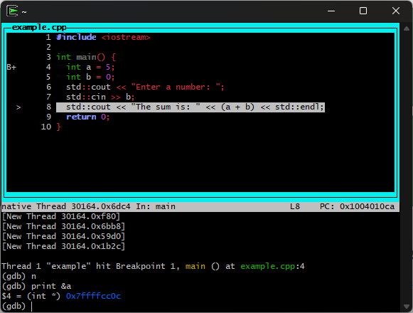

A beginner's guides to debugging C and C++ programs with GDB.

<!-- truncate -->

## TLDR

The goal of this page is to be a reference to come back to when you want to debug with GNU Debugger (GDB).
The first few sections are more educational and provide a basic understanding of GDB and Cygwin. The later sections are more practical and provide a reference for using GDB in Cygwin.

<div style="text-align: center;">
  
</div>

## Other Options

Since originally writing this, I have found that using Visual Studio Code with
the C/C++ extension is a _much_ better option for debugging C and C++ programs.
However, in my _opinion_, there is still a steeper learning curve to configuring C++
in Visual Studio Code. A big reason it is harder to use for a beginner is because you have to understand how VsCode is configuring the debugger and how it is using GDB or LLDB under the hood.

You might opt for cygwin to get a more basic and native experience with
C and C++ debugging. You will also understand the Visual Studio Code debugger better if you
start with GDB in Cygwin (VsCode uses GDB, LLDB, etc under the hood for C and C++ debugging).

## Setting Up Cygwin

What is Cygwin? [Cygwin](https://www.cygwin.com/) is a Unix-like environment for Windows. It allows
developers to have access to a more Unix-like terminal and tools. I say
"Unix-like" because it is not a full Unix system. Cygwin uses a DLL called
`cygwin1.dll` to interact with Windows. To have a full Unix, Linux system on your Windows machine, see
[WSL](https://docs.microsoft.com/en-us/windows/wsl/install) or [Virtual Machines](https://www.virtualbox.org/).

To set up Cygwin, you can follow the instructions on the [Cygwin
website](https://www.cygwin.com/). The Cygwin installer is named `setup-x86_64.exe`. There are different mirrors you can select
from, they all should provide the packages being downloaded. Continue to the download page. On the download page, there are different buttons like filters and version selections you can use to
customize your Cygwin install. If you rerun the installer (`setup-x86_64.exe`), you can update your
custom install. You do not need to install everything (MASSIVE DOWNLOAD!). The recommended installs for this environment setup are the following:

- Base Category:
  - All packages in the Base category (May be automatically selected)
- Devel Category:
  - gcc-core
  - gcc-g++
  - clang
  - gdb
- Debug Category:
  - gdb-debuginfo
  - gdbm-debuginfo
- nano

Continue the install until it is complete. You can also install other packages,
such as `make`, [`cmake`](https://cmake.org/), and [`git`](https://git-scm.com/)
if you want to level up your development environment.

## The Cygwin Folder Structure

Just a quick note on the Cygwin folder structure. The Cygwin install will create a folder called `C:\cygwin64`. Cygwin will use its own folder structure outside of the Windows folder structure. If you want your project to exist within the Windows folder structure,
use `cd C:// && ls` to get to the root of the C drive. To get back to the Cygwin user folder, use `cd ~`.

## Getting Started with GDB

This section will cover a basic step-by-step example of using GDB to debug a binary executable.

0. Validate installs: `gdb --version`, `gcc --version`, `g++ --version`,
1. Create a simple C or C++ program to debug. For example, create a file with the following steps:

   1. Create a file either with Notepad++ or with `nano example.cpp`
   2. Write and save a simple program in the file:

      ```cpp
      #include <iostream>

      int main() {
          int a = 5;
          int b = 0;
          std::cout << "Enter a number: ";
          std::cin >> b;
          std::cout << "The sum is: " << (a + b) << std::endl;
          return 0;
      }
      ```

   3. Validate the file is saved by running `cat example.cpp` to see the contents of the file.
   4. Use `g++ -Wall -g -o example example.cpp` to compile the program. The `-Wall` flag enables all warnings, and the `-g` flag includes debugging information in the binary. `-g` is required for GDB to work properly.
   5. `ls` to see the compiled binary `example` in the current directory.
   6. To run the program with GDB, use `gdb ./example -tui`. The `-tui` flag enables the text user interface for GDB, which is more user-friendly. You don't have to use `-tui`, but I find it significantly easier to use and closer to a Visual Studio Code experience.
   7. Press enter to start GDB. Once you see `(gdb)`, you are in the GDB terminal. You can use gdb terminal commands to debug the program.
   8. `r` to run the program. If you have not set any breakpoints, it will run to completion and exit. If you want to set a breakpoint, see the next step.
   9. `b 4` to set a breakpoint at line 4 of the source code.
   10. `r` to run the program again. This time, it will stop at the breakpoint you set.
   11. `n` to step to the next line of code.
   12. `print a` to print the value of `a`. Definitely experiment with printing other types of variables and expressions. You can do pointer dereferencing, arithmetic, and more. This is extremely useful for memory management debugging. The print statement can do A LOT like math `print a + 6` or `print &a`.
   13. `n` until you enter a number. After you enter a number, it will look messy on the terminal. This happens when you use `std::cin` or `std::cout`. The terminal will show the output of the program, which can make it hard to read. You can clear the terminal with `CTRL + L` to make it easier to read.
   14. `c` to continue running the program until it exits or hits another breakpoint.

That's it for the example! Now you can use the [commands below](#useful-commands) to debug the program. I will be adding to this section as I learn more about the GDB terminal.

## Useful commands

How I use a minimal C and C++ setup and useful commands. This section is for reference only and therefore the explainations are minimal. You can always search for more information on the commands you are interested in.

### Compile and Starting in GDB GUI

For C: `gcc -Wall -g -o <OutputName> <file1.c> <file2.c> && gdb ./<OutputName> -tui`

For C++: `g++ -Wall -g -o <OutputName> <file1.c> <file2.c> && gdb ./<OutputName> -tui`

### Using Auto Complete

`tab`

### Running the application

`press enter on GDB start`
`r` for run (make sure you have breakpoints set first or it will just run)
You can restart the program by calling `r` again

### Use Previous Command

`Enter` to run the previous command again

### Refresh the GUI screen

`CTRL + L`

### Next (Step Over)

`n`

### Step Into

`s`

### Continue

`c`

### Exit/Quit GDB

`q`

### Set a Breakpoint

`b <classname>::<methodname>` or `b <linenumber>` or `b <functionName>`

### Changing Window Focus

`focus cmd` for repeating commands (can use mouse scroll to move source code in this mode)
`focus src` to move the displayed source code window (can use arrow keys to move source code in this mode)

### Printing

can use `print(<variable>)` for a quick check
can use `printf("<regular c string formatter here>");` for a more complex check

Example:
`print this->idM`
`print &this`
`print a + 6`

### Segmentation Fault - Backtrace

`bt` or `backtrace`

## References

Below are some additional references that I found useful learning GDB. Definitely check them out to learn much more!

- [Cygwin Documentation](https://www.cygwin.com/)
- [C in a Nutshell by Peter Prinz & Tony Crawford. Oreilly. Chapter 21: Debugging C Programs with GDB](https://www.oreilly.com/library/view/c-in-a/9781491924174/)
- [Old GNU Manual](https://ftp.gnu.org/old-gnu/Manuals/gdb/html_chapter/gdb_19.html)
